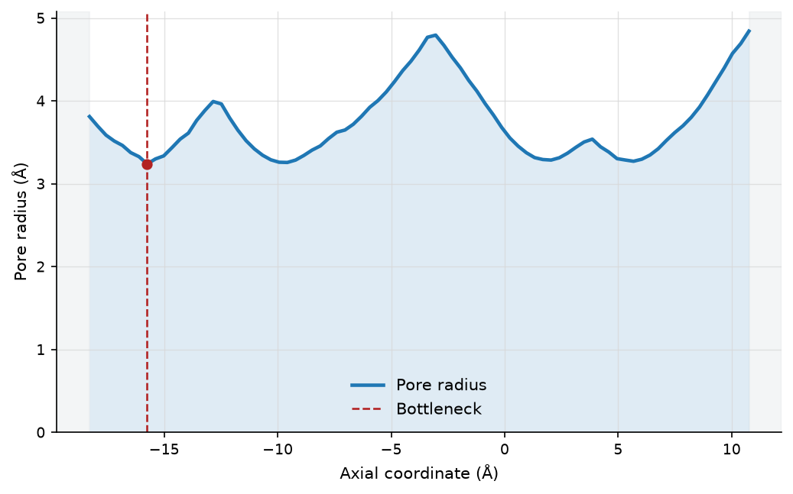
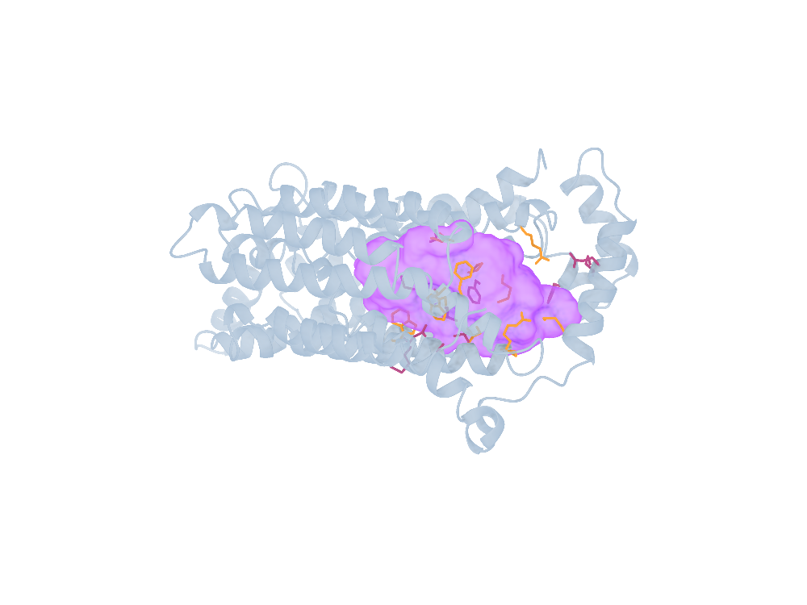
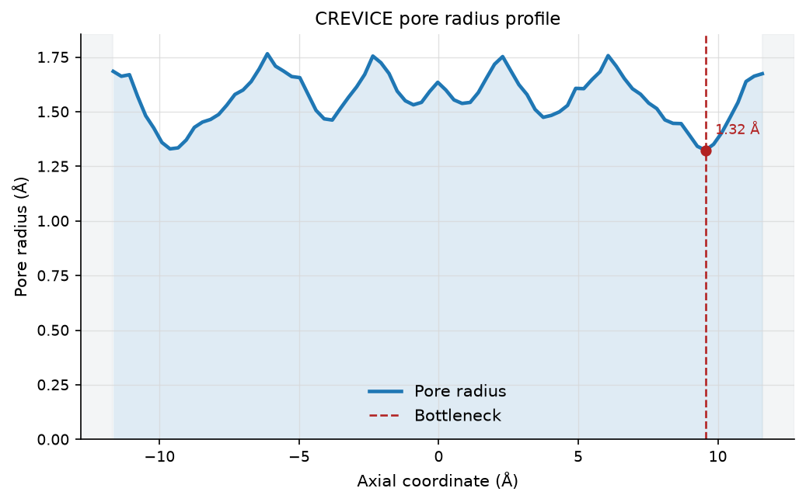
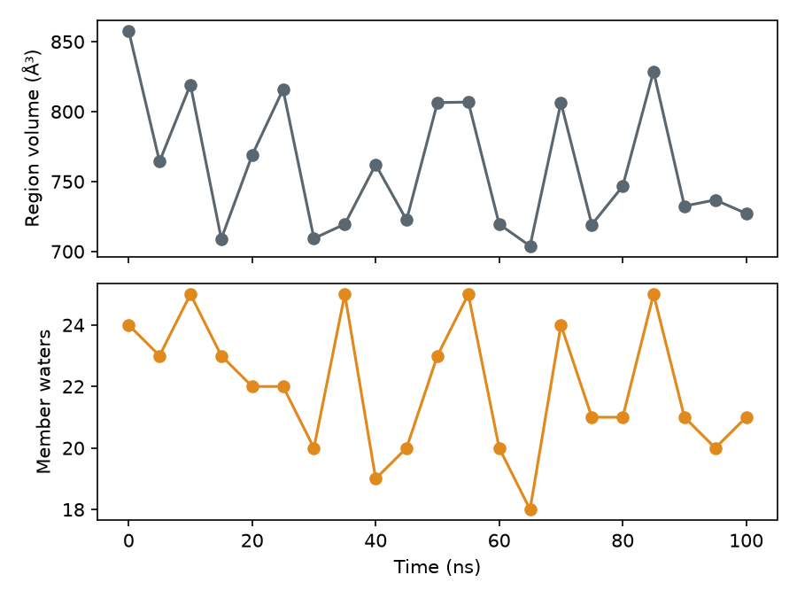

# Tutorials

These tutorials work through real, public structures from download to
figures. Each one shows the commands, what they print and the files and
pictures you get, so you can follow along or simply read. The structures are
downloaded from the RCSB PDB or AlphaFold DB the first time you run a command.

::::{container} crevice-cards

:::{container} crevice-card


**[1GRM: pore radius profile and channel cast](1grm-profile-cast.md)**

Measure the gramicidin A channel, then write the full bundle with its 3D cast. *About 1 min.*
:::

:::{container} crevice-card crevice-exit


**[3UKM: a capped channel with side exits](3ukm-lateral-exits.md)**

Follow the TWIK-1 pore out through its two side portals. *About 10 min.*
:::

:::{container} crevice-card


**[1OED: a wide pore with gaps in its wall](1oed-pore-domain.md)**

See how the automatic enclosure probe copes with a leaky pore domain. *About 2 min.*
:::

:::{container} crevice-card crevice-violet


**[4PYP: a cavity and the residues around it](4pyp-cavity-residues.md)**

Cast the inward-open GLUT1 cavity and find the residues that form its wall. *About 2 min.*
:::

:::{container} crevice-card crevice-entry


**[Atomic radii and figure text](custom-radii-annotate.md)**

Compare radius sets, use your own radius file, and add labels to figures. *Under 1 min.*
:::

:::{container} crevice-card crevice-exit


**[A first trajectory: the 1GRM NMR ensemble](trajectory-nmr-ensemble.md)**

Profile a channel in every frame and summarise it, from the command line and Python. *Under 1 min.*
:::

:::{container} crevice-card crevice-violet
**[An AlphaFold DB model](alphafold-model.md)**

Fetch a predicted structure by its identifier and cast its interior. *Under 1 min.*
:::

:::{container} crevice-card


**[A membrane MD trajectory: water in the GLUT1 sugar site](glut1-trajectory.md)**

Download a short excerpt of a GLUT1 membrane simulation, measure a named region in every frame, and count the waters inside it. *About 2 min, plus an 11.8 MB download.*
:::

::::

Every command and Python block was run with CREVICE {{ version }} and the
numbers were copied from that run; viewer images were rendered in the viewer
named in the caption. The pages aren't executed when the documentation is
built, so your numbers may differ slightly with a newer version or different
settings, and that's part of the lesson: the settings are part of the result.
Times are for one CPU core of a desktop computer.


## Running all the tutorials yourself

From a checkout of the source repository, with CREVICE installed:

```bash
bash examples/run_worked_examples.sh results/worked-examples
```

The script downloads the structures into `results/worked-examples/.crevice/pdb`
and runs every command of these pages in its own subdirectory, writing each
command's output to `commands.log`. It needs network access for the
downloads, about 15 minutes and about 50 MB of disk space.

## Examples with known answers

The `examples/` directory of the source repository also contains scripts that
use mathematical atom walls with known answers rather than proteins, so they
need no downloads:

| Script | What it shows |
| --- | --- |
| `examples/geometry_demo.py` | a synthetic channel analysed as a short trajectory: profile distribution, void cast and viewer bundle, with a manifest of parameters and file hashes |
| `examples/connectivity_validation.py` | continuous-path connectivity across grid spacings and offsets on synthetic walls (a 48-case sweep with JSON and figures) |

```bash
python examples/geometry_demo.py --output results/geometry-demo
python examples/connectivity_validation.py --output results/connectivity-check
```


```{toctree}
:hidden:

1grm-profile-cast
3ukm-lateral-exits
1oed-pore-domain
4pyp-cavity-residues
custom-radii-annotate
trajectory-nmr-ensemble
alphafold-model
glut1-trajectory
```
