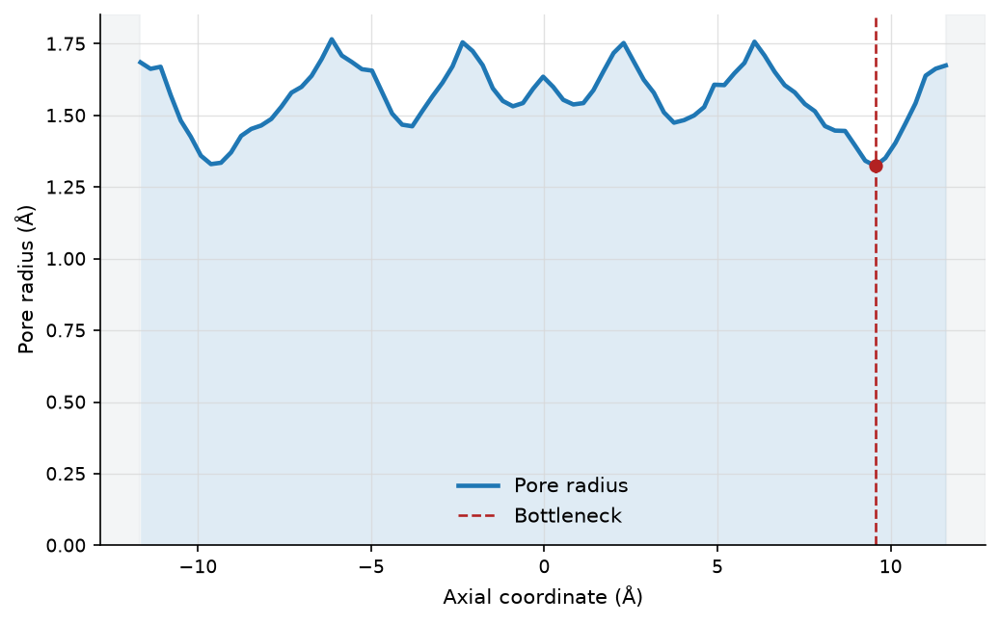
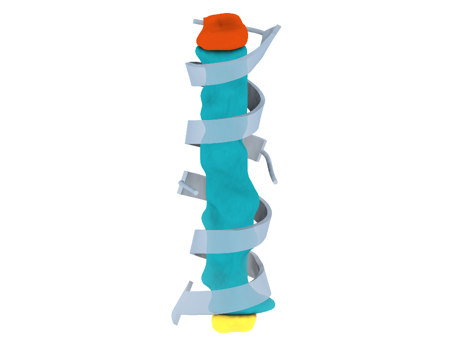
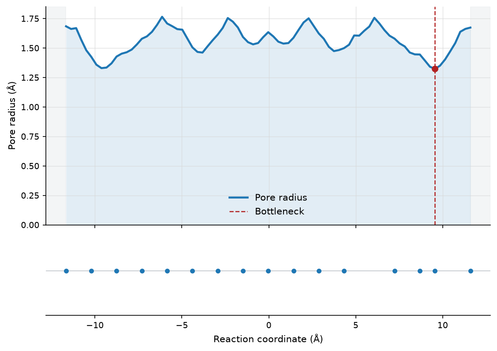
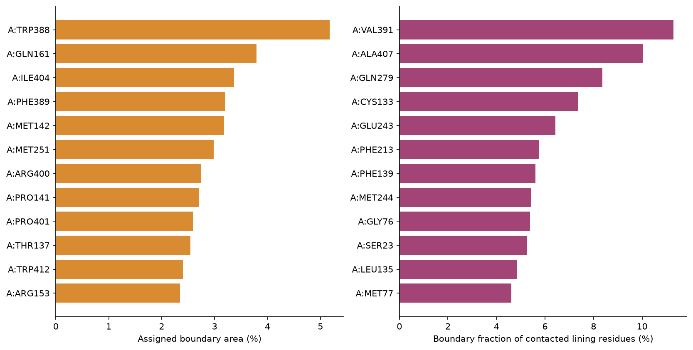
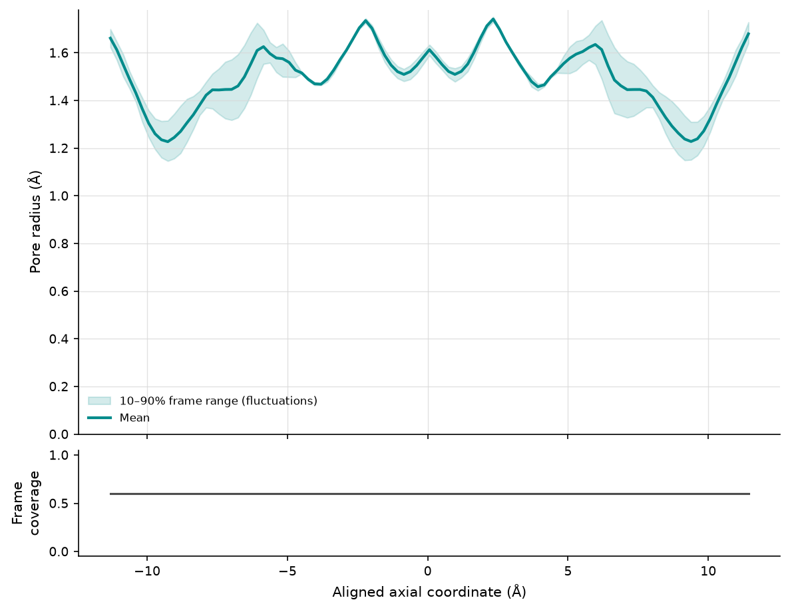
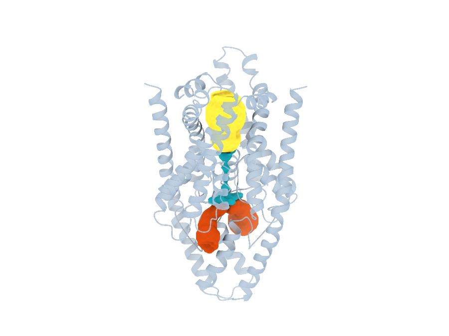

# Analysis tools

CREVICE's tools are grouped by the question you are asking. Each page explains
what the tool measures and how, the options you are most likely to change,
what it writes and how to read the results. The complete option list for every
command is in the [command-line reference](../reference/cli/index.md).

## Pores and channels

::::{container} crevice-cards

:::{container} crevice-card


**[Pore radius profiles](profile.md)**

How wide a channel is along its length, and where it is narrowest.

`crevice profile`
:::

:::{container} crevice-card


**[Cavity and channel casts](cast.md)**

The 3D shape and volume of a pocket, cavity or channel.

`crevice cast`
:::

::::

## Cavities and tunnels

Casts also handle cavities and pockets, on a finer grid and with more control. The two grid searches here are quick, coarse overviews.

::::{container} crevice-cards

:::{container} crevice-card crevice-violet
**[Buried cavities](cavities.md)**

Enclosed empty spaces inside the protein.

`crevice cavities`
:::

:::{container} crevice-card crevice-violet
**[Access tunnels](tunnels.md)**

The widest routes from a site to the outside.

`crevice tunnels`
:::

::::

## Residues and networks

::::{container} crevice-cards

:::{container} crevice-card crevice-entry


**[Lining residues](residues.md)**

Which residues line a channel, and which one makes the bottleneck.

`crevice residues`
:::

:::{container} crevice-card crevice-entry


**[Boundary residues and their partners](residue-evidence.md)**

Which residues form the wall of a cast, and which other residues touch them.

`crevice residue-evidence`
:::

:::{container} crevice-card crevice-entry
**[Residue networks](network.md)**

Which residues contact each other and the channel or cavity.

`crevice network`
:::

::::

## Hydration

::::{container} crevice-cards

:::{container} crevice-card
**[Hydration](hydration.md)**

Where the waters are, how exposed each residue is, and which waters sit inside a cavity.

`crevice hydration`
:::

::::

## Trajectories and regions

::::{container} crevice-cards

:::{container} crevice-card crevice-exit


**[Channel profiles over a trajectory](trajectory.md)**

How a channel's width and lining change from frame to frame.

`crevice trajectory`
:::

:::{container} crevice-card crevice-exit
**[Cavities over a trajectory](cavity-trajectory.md)**

A cavity's volume, width and wall residues through a simulation.

`crevice cavity-trajectory`
:::

:::{container} crevice-card crevice-exit
**[Named regions](regions.md)**

Define a region once, review it, and compare it fairly across runs.

`crevice region-*`
:::

::::

## Visualisation and outputs

::::{container} crevice-cards

:::{container} crevice-card


**[One-command output bundle](publish.md)**

Every table, figure and viewer scene for a structure in one run.

`crevice publish`
:::

:::{container} crevice-card
**[Utility and batch commands](utilities.md)**

Downloads, several analyses at once, feature tables and batch runs.

`crevice fetch, analyze, features, benchmark, static-suite`
:::

::::

## Methods in more depth

The [method notes](../methods/index.md) give the full definitions behind the
tools: atomic radii, hydration statistics, trajectory cavities, obstacles,
named regions and display smoothing.

(validation-levels)=
## How far to trust the numbers

Everything CREVICE reports is a geometric measurement made with the settings
you chose. The software is tested on synthetic structures with known answers,
and its examples were run on real proteins, but its benchmark structures are
not curated references: channel axes and regions are chosen by the analysis
or by you. Treat a radius, volume or residue list as a well-defined
measurement, and as a starting point for biological interpretation that still
needs independent evidence, such as mutagenesis, functional data or other
structures.

```{toctree}
:maxdepth: 1
:hidden:

profile
cast
cavities
tunnels
residues
residue-evidence
network
hydration
trajectory
cavity-trajectory
regions
publish
utilities
../methods/index
```
